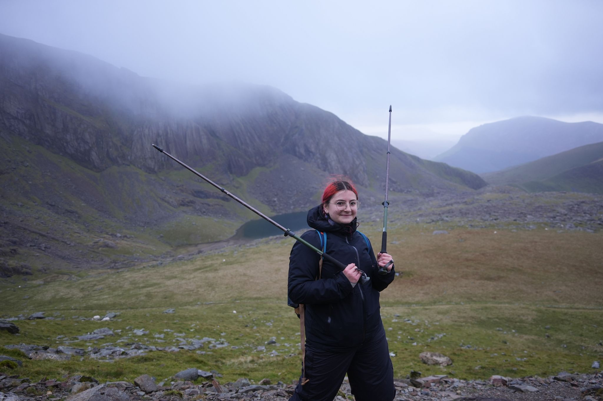

I am from Romania, but have been studying in the UK since 2019 (Year 12), when I received an [HMC scholarship](https://www.hmc.org.uk/about-us/hmc-projects/student-scholarships/) at [RMS for Girls](https://www.rmsforgirls.com/) in Rickmansworth, Hertfordshire.

I did my undergraduate and integrated master's at the University of Cambridge. I was a member of [Peterhouse](https://www.pet.cam.ac.uk/).

Outside of maths, I enjoy scouting (see [SSAGO](https://www.ssago.org/) and, formerly, [CUSAGC](https://cusagc.soc.srcf.net/)), archery, hiking, crochet, and too many other temporary hobbies. 

I also collect postcards. If you'd like to help my collection, feel free to send me one, and I'll send one back!

Me on the trail to Snowdon, October 2025
