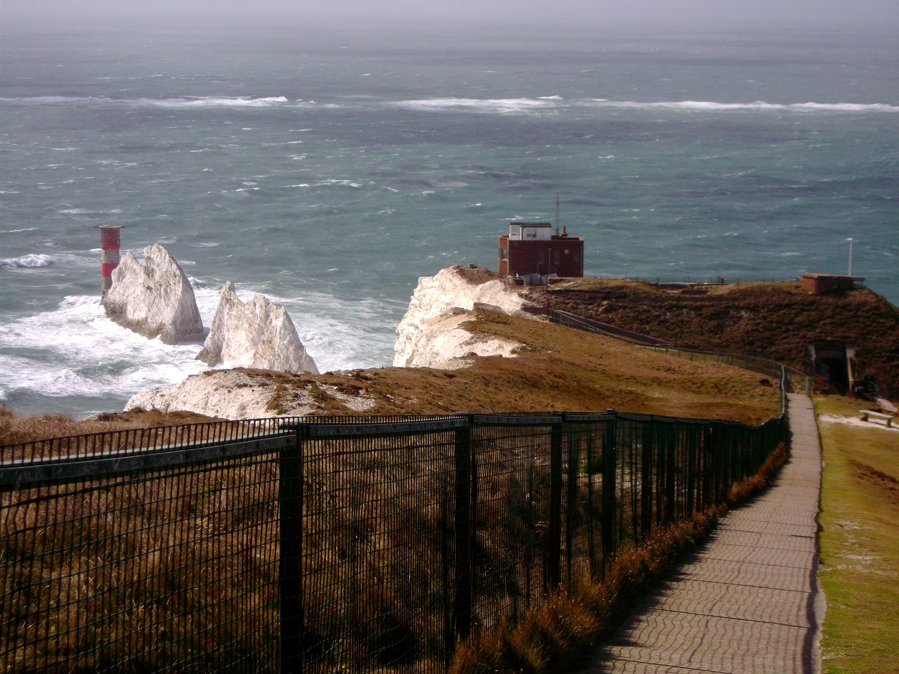

<!-- ## upcoming -->

## history
1. [**ICMS Winter School: PDE in Geometry and Analysis**](https://pde-geometry-analysis.github.io/) - 6th-9th January 2026, Edinburgh
    
    
View of Edinburgh from Arthur's Seat, January 2026

1. [**British Isles Graduate Workshop VI**](https://enric-sf.github.io/BIGW_VI/index.html) - 1st-5th September 2025, Isle of Wight

    
    
The Needles, Isle of Wight, September 2025

