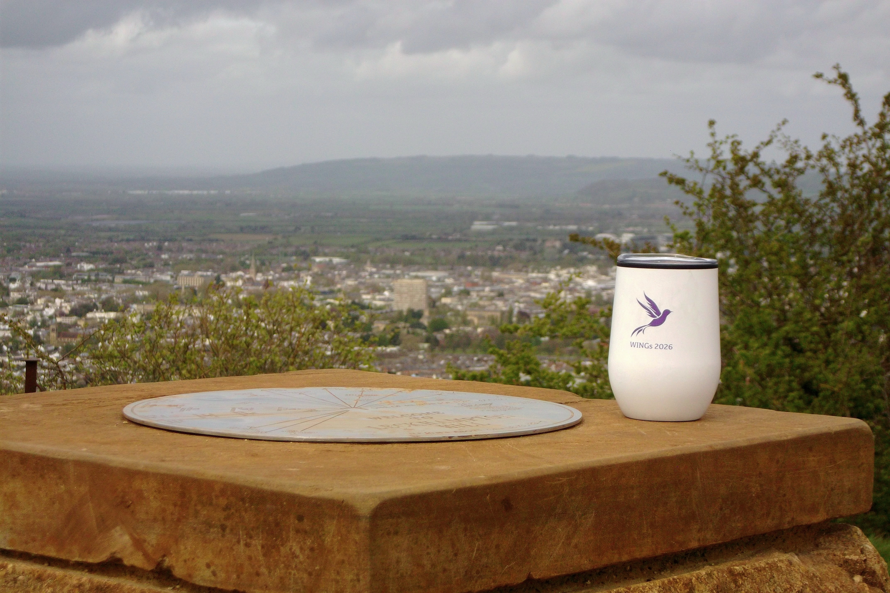
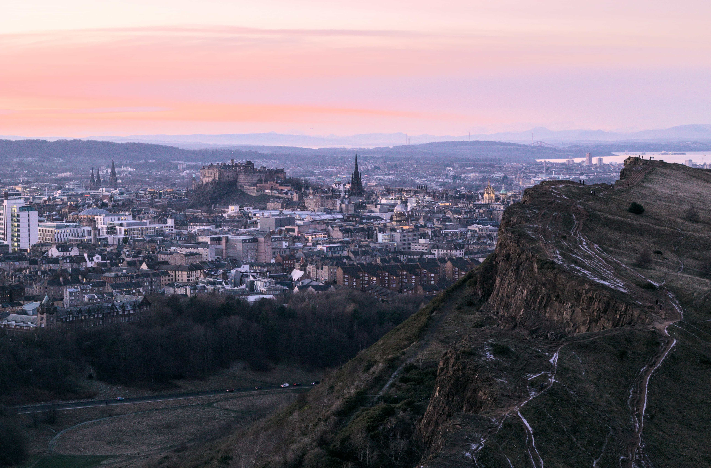
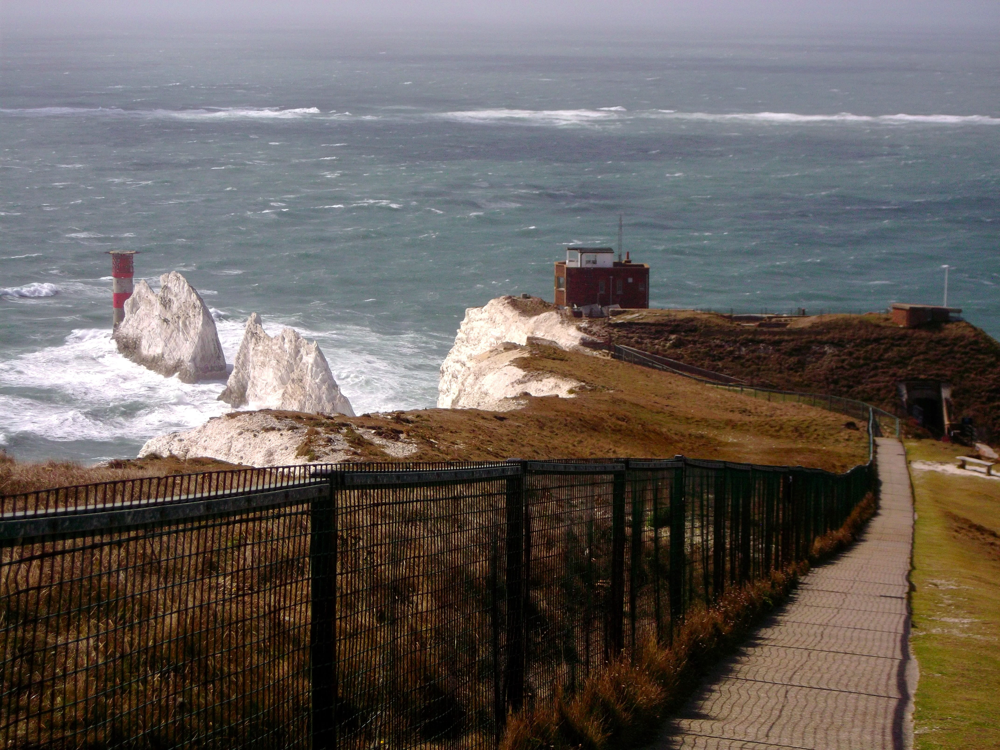

## upcoming
1. [**All Codimensions Mean Curvature Flow and Minimal Surfaces**](https://www.math.ku.dk/english/calendar/events/codimensions26/) - 27th April-1st May 2026, Copenhagen, Denmark
1. [**European School of Differential Geometry**](https://sites.google.com/view/esdg-aq26) - 22nd June-3rd July 2026, L'Aquila, Italy

## history
1. [**Women in Number Theory and Geometry Spring Retreat 2026**](https://wings2026.github.io/) - 13-16th April 2026 - Cheltenham, UK
    
    
Leckhampton Hill with Cheltenham in the background, April 2026

1. [**Brussels-London XXV: The geometry of phase transitions**](https://geometry.ulb.ac.be/brussels-london/) - 30th January 2026, Brussels, Belgium
    
    
Mont des Arts, Brussels, January 2026

1. [**ICMS Winter School: PDE in Geometry and Analysis**](https://pde-geometry-analysis.github.io/) - 6th-9th January 2026, Edinburgh, UK
    
    
View of Edinburgh from Arthur's Seat, January 2026

1. [**British Isles Graduate Workshop VI**](https://enric-sf.github.io/BIGW_VI/index.html) - 1st-5th September 2025, Isle of Wight, UK
    
    
The Needles, Isle of Wight, September 2025

